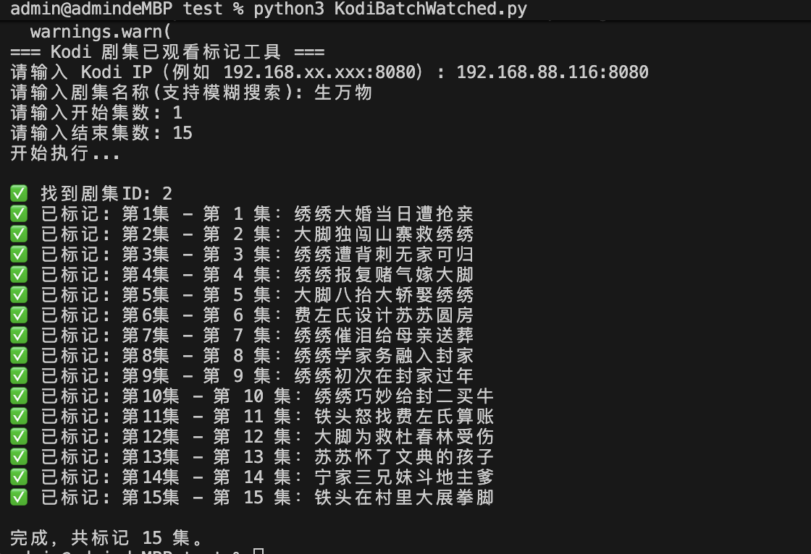

## 项目说明
* kodi 剧集批量标记 已观看
* kodi batch watched

## 环境
* python3

## 安装依赖
* pip3 install requests

## 执行前准备 确认 Kodi 已开启 Web 控制
* Kodi 上操作：
* 打开 设置（齿轮图标）
* 进入 → 服务 (Services)
* 左侧选择 → 控制 (Control)
* 然后确认以下选项：
* 允许通过 HTTP 进行远程控制（Allow remote control via HTTP）
* 允许通过其他系统的控制（Allow remote control from applications on other systems）
* Web 服务器端口（Port）8080
* 用户名/密码 设置为空

## 执行
* python3 KodiBatchWatched.py

## 截图

